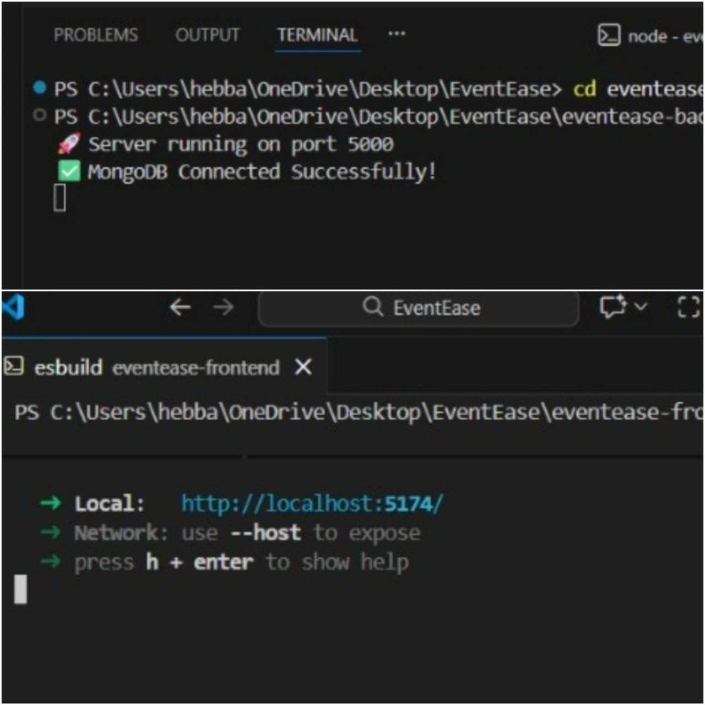
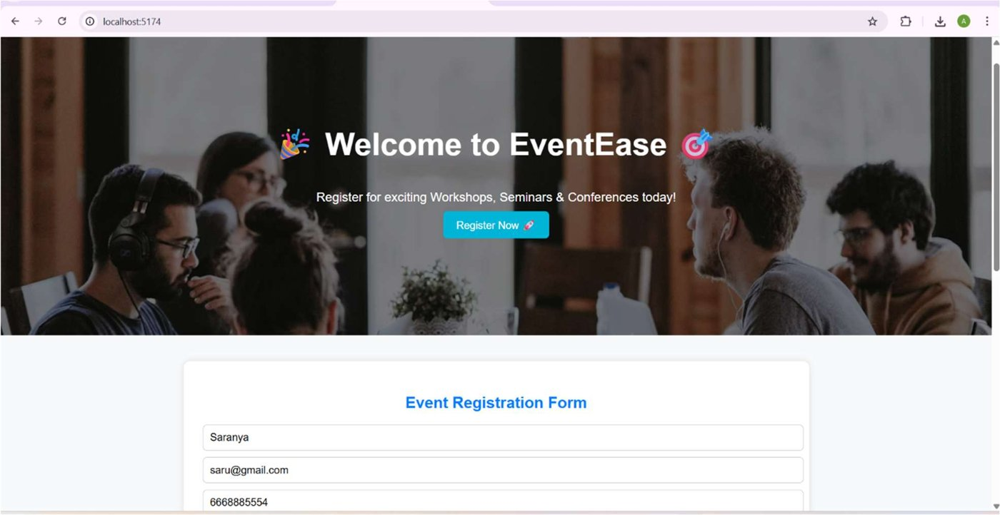
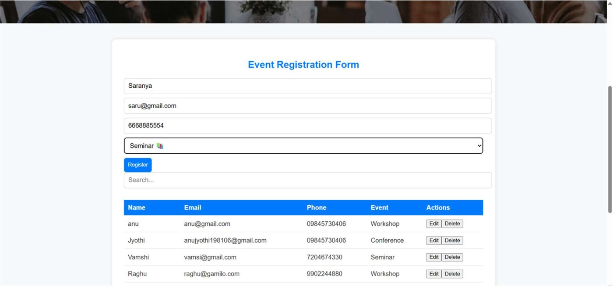
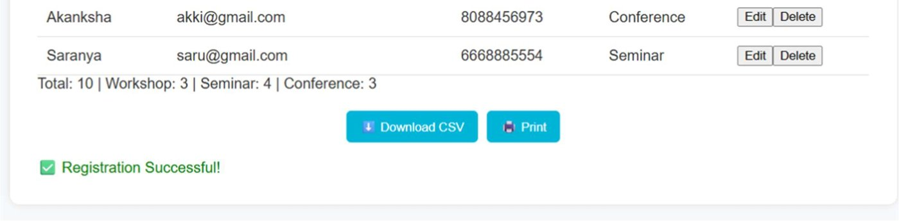
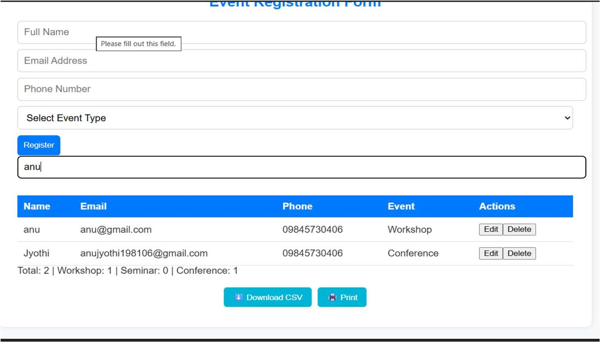
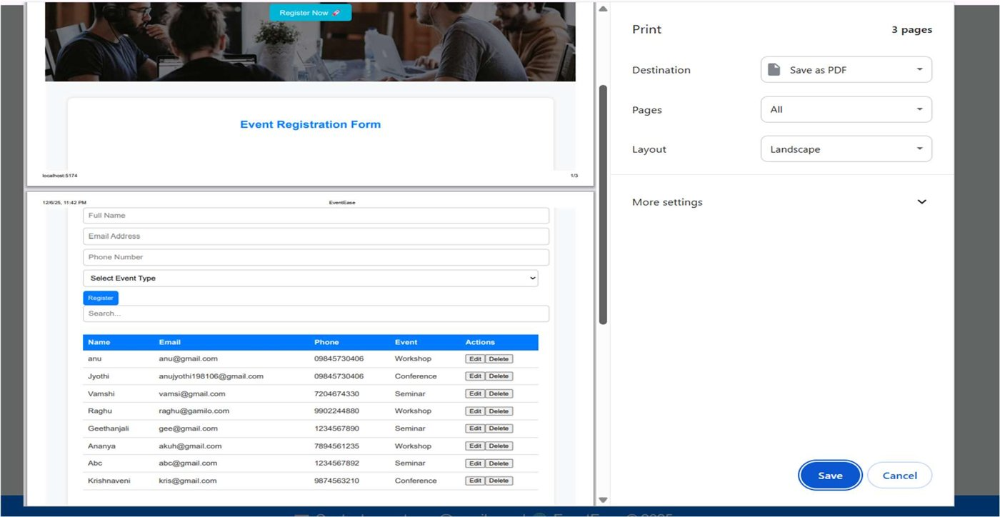
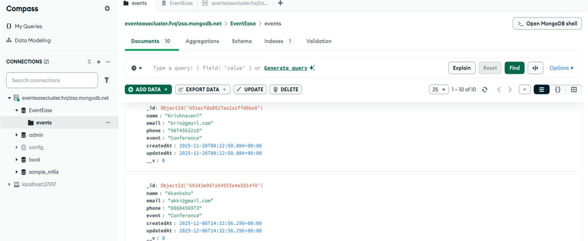
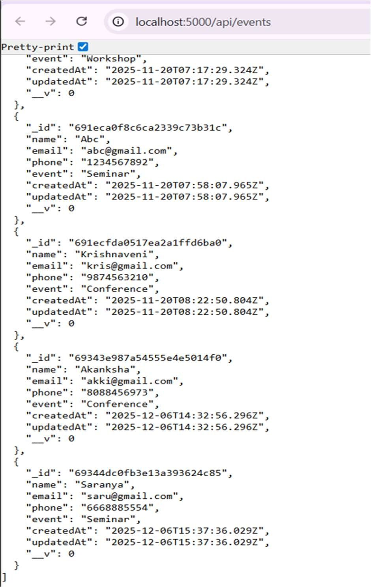

# 🎉 EventEase – Event Registration System (MERN Stack)


EventEase is a full-stack web app where users can register for **Workshops, Seminars and Conferences**. Registrations are stored in **MongoDB** through a **Node.js + Express** REST API and shown live in a React table with search, edit, delete, CSV export and print.

Built as a Full Stack Development mini-project (Semester 5) at **Mangalore Institute of Technology & Engineering**, Dept. of Computer Science & Engineering.

---

## ✨ Features

- 📝 Registration form (name, email, phone, event type) with validation
- 📋 Live participants table that refreshes after every change
- 🔍 Instant search by name or email
- ✏️ Edit and 🗑️ delete registrations
- 📊 Summary counts: total, workshop, seminar, conference
- ⬇️ Export all participants to **CSV**
- 🖨️ Print / save the list as PDF
- ✅ Toast notification on successful registration
- 🕒 Automatic `createdAt` / `updatedAt` timestamps

## 🧰 Tech Stack

| Layer    | Technology                          |
| -------- | ----------------------------------- |
| Frontend | React 18, Vite, JavaScript (ES6), CSS3, Fetch API |
| Backend  | Node.js, Express.js, Mongoose, CORS, dotenv |
| Database | MongoDB Atlas (or local MongoDB)    |

## 🏗️ Architecture

```
React (Frontend)  →  Express API (Backend)  →  MongoDB (Database)
React (UI)        ←  JSON Response          ←  Stored Data
```

## 📸 Screenshots

**Backend & frontend running**


**Home page**


**Registration form and participants table**


**Success toast, event counts, CSV download and print**


**Search**


**Print / Save as PDF**


**Data stored in MongoDB (Compass)**


**Raw API output – `GET /api/events`**


## 📁 Project Structure

```
EventEase/
├── README.md
├── LICENSE
├── .gitignore
├── docs/
│   ├── FSD_Project_Report.pdf      # Full project report
│   └── images/                     # Screenshots used in this README
├── eventease-backend/
│   ├── server.js                   # Express server + MongoDB connection
│   ├── models/Event.js             # Mongoose schema
│   ├── routes/eventRoutes.js       # GET / POST / DELETE routes
│   ├── package.json
│   └── .env.example                # Copy to .env and add your own values
└── eventease-frontend/
    ├── index.html
    ├── vite.config.js
    ├── package.json
    ├── .env.example                # Optional API URL override
    └── src/
        ├── main.jsx
        ├── App.jsx
        ├── App.css
        └── components/
            ├── Hero.jsx
            ├── RegistrationForm.jsx
            ├── RegistrationTable.jsx
            └── Toast.jsx
```

## 🚀 Getting Started

### Prerequisites

- [Node.js](https://nodejs.org/) 18+
- A MongoDB database: either a free [MongoDB Atlas](https://www.mongodb.com/atlas) cluster **or** MongoDB installed locally

### 1. Clone the repository

```bash
git clone https://github.com/<your-username>/EventEase.git
cd EventEase
```

### 2. Set up the backend

```bash
cd eventease-backend
npm install
```

Create a file named `.env` inside `eventease-backend/` (copy `.env.example`) and add your connection string:

```env
MONGODB_URI=mongodb+srv://<username>:<password>@<your-cluster>.mongodb.net/EventEase?retryWrites=true&w=majority
PORT=5000
```

> 🔐 **Never commit `.env`.** It is already listed in `.gitignore`.
> If your password has special characters, URL-encode them (for example `@` becomes `%40`).
> Using local MongoDB? You can skip `.env` entirely: the server falls back to `mongodb://127.0.0.1:27017/EventEase`.

Start the server:

```bash
npm run dev      # with nodemon (auto-reload)
# or
npm start        # plain node
```

You should see:

```
🚀 Server running on port 5000
✅ MongoDB Connected Successfully!
```

### 3. Set up the frontend

Open a second terminal:

```bash
cd eventease-frontend
npm install
npm run dev
```

Open **http://localhost:5174** in your browser.

If your backend is not on `http://localhost:5000`, copy `eventease-frontend/.env.example` to `.env` and change `VITE_API_URL`.

## 🔌 API Endpoints

Base URL: `http://localhost:5000/api/events`

| Method   | Endpoint | Description                      |
| -------- | -------- | -------------------------------- |
| `GET`    | `/`      | Get all registrations            |
| `POST`   | `/`      | Create a new registration        |
| `DELETE` | `/:id`   | Delete a registration by its ID  |

**Example request body (`POST`)**

```json
{
  "name": "Jane Doe",
  "email": "jane@example.com",
  "phone": "9876543210",
  "event": "Workshop"
}
```

## 🗃️ Data Model

| Field       | Type   | Required | Notes                              |
| ----------- | ------ | -------- | ---------------------------------- |
| `name`      | String | ✅       |                                    |
| `email`     | String | ✅       |                                    |
| `phone`     | String | ✅       |                                    |
| `event`     | String | ✅       | `Workshop`, `Seminar`, `Conference` |
| `createdAt` | Date   | auto     | added by Mongoose                  |
| `updatedAt` | Date   | auto     | added by Mongoose                  |

## 📄 Project Report

The complete report with code walkthrough and outputs is in [`docs/FSD_Project_Report.pdf`](docs/FSD_Project_Report.pdf).

## 🔮 Future Improvements

- Admin login and authentication
- QR code generation for registered participants
- Analytics dashboard
- Event fee payment integration
- Server-side validation and a proper `PUT` route for editing (currently edit = delete + re-register)

## 👩‍💻 Authors

| USN         | Name           |
| ----------- | -------------- |
| 4MT23CS023  | Ananya Hebbar  |
| 4MT23CS025  | Anjali P       |

**Course:** Full Stack Development (23CSPE311) · **Faculty:** Dr. Clara Kanmani A · **Academic Year:** 2025–26

## 📜 License

Released under the [MIT License](LICENSE).
